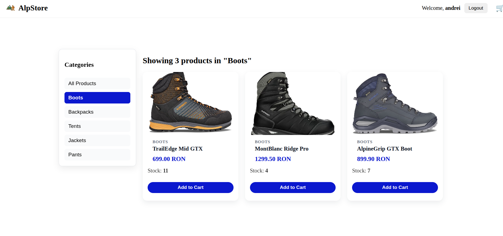
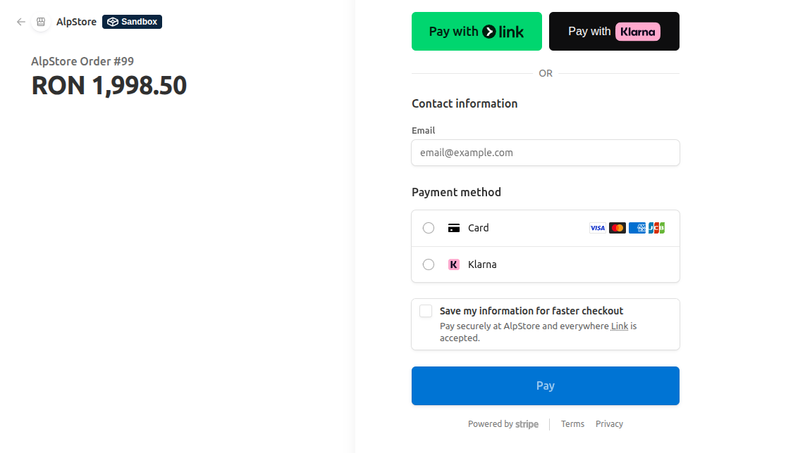

# AlpStore - Distributed Web Platform  
 #### Copyright Alexandru-Andrei CRET - 343C2


## 1. Project Overview

**AlpStore** is a distributed web platform designed to manage an online mountain equipment store.  
The system is implemented using a **microservices architecture**, orchestrated with **Docker Swarm**, and aims to demonstrate key concepts of **concurrent and distributed systems**.

The project focuses on:
- scalability through service replication;
- fault tolerance and isolation via microservices;
- asynchronous communication between services;
- centralized authentication and authorization (SSO);
- secure and controlled inter-service communication.

The platform allows users to:
- authenticate using **Keycloak (OIDC)**;
- browse a product catalog;
- manage a shopping cart;
- place orders;
- perform online payments using **Stripe (test mode)**;
- track order status updated asynchronously.

---



## 2. High-Level Architecture

The application is composed of multiple Dockerized microservices, deployed as a **Docker Swarm stack** and exposed externally through **Traefik**.

### Core components:
- **Frontend (React + Nginx)**
- **Product Service**
- **User Profile Service**
- **Order Service + Backend(replicated)**
- **Payment Service**
- **Keycloak (SSO)**
- **PostgreSQL**
- **RabbitMQ**
- **Traefik (reverse proxy & load balancer)**

All services communicate exclusively via **Docker internal DNS**, using service names and environment variables.


## 3. Frontend Implementation

The frontend is a **React** application served via **Nginx**.

### Responsibilities:
- user authentication via Keycloak;
- token management (OIDC access token);
- communication with backend services via REST APIs;
- redirecting users to Stripe Checkout;
- displaying order and payment status.

### Example: attaching OIDC token to API requests

```javascript
fetch(`${API_URL}/orders`, {
  method: "POST",
  headers: {
    "Authorization": `Bearer ${keycloak.token}`,
    "Content-Type": "application/json"
  },
  body: JSON.stringify(orderData)
});
```

## 4. Backend Microservices

All backend microservices are implemented using **Python (Flask)** and expose RESTful APIs.  
Each service follows the single-responsibility principle and is fully containerized.

Common characteristics:
- REST API design
- OIDC/JWT token validation (Keycloak)
- PostgreSQL persistence via SQLAlchemy
- Configuration through environment variables
- Docker Swarm deployment


### 4.1 Product Service

The **product-service** is responsible for managing the product catalog.

Responsibilities:
- CRUD operations for products
- Public product listing
- Admin-only management endpoints
- Persistent storage using PostgreSQL

Example: SQLAlchemy product model

```python
class Product(db.Model):
    __tablename__ = "products"

    id = db.Column(db.Integer, primary_key=True)
    name = db.Column(db.String(120), nullable=False)
    price = db.Column(db.Float, nullable=False)
    description = db.Column(db.String(255))
```

### 4.2 User Profile Service

The **user-profile-service** is responsible for managing application-level user data and roles. It is integrated along the components.

Responsibilities:
- Create user profiles automatically on first authentication
- Update user metadata received from Keycloak
- Manage application-level roles and permissions
- Expose profile information to other internal services

Example: extracting user data from Keycloak token

```python
username = token["preferred_username"]
email = token["email"]
roles = token.get("realm_access", {}).get("roles", [])
```

### 4.3 Order Service

The **order-service** manages customer orders and integrates with the payment service.

Responsibilities:
- Accept order creation requests from the frontend
- Persist order data to PostgreSQL
- Consumes payment confirmation events from RabbitMQ
- Update order status based on payment events
- Support order retrieval and history tracking

Key features:
- Asynchronous payment processing via message queue
- Unique constraint to prevent duplicate orders
- JWT token validation for authenticated endpoints

Database schema:
- Orders table with user ID, total amount, status, and timestamps

### 4.4 Payment Service

The **payment-service** handles all payment processing using Stripe.

Responsibilities:
- Create Stripe Checkout sessions for order payments
- Validate Stripe webhook signatures
- Process payment success/failure events
- Publishes payment status events to RabbitMQ
- Update order status based on payment confirmation

Workflow:
1. Frontend receives Stripe Checkout URL from payment service
2. Customer completes payment on Stripe
3. Stripe sends webhook to payment service
4. Payment service publishes event to RabbitMQ
5. Order service consumes message and updates order status


## 5. Data Persistence

The system uses **PostgreSQL** for persistent data storage across all microservices.

### Database Features:
- Each service accesses PostgreSQL using its own database connection configuration.
- SQLAlchemy ORM for Python services
- Schema migrations via Flask-Migrate
- Tables for: products, users, orders, payments


## 6. Asynchronous Communication

**RabbitMQ** enables asynchronous message passing between order and payment services.

### Queue Architecture:
- **Queue Name:** `order_payments`
- **Message Format:** JSON with order ID, payment status, timestamp
- **Consumers:** Order service listens for payment updates
- **Publishers:** Payment service publishes payment events

Benefits:
- Decoupled services (payment failures don't block order service)
- Reliable message delivery with persistence
- Scalable message processing

---

## 7. Authentication & Authorization

The system uses **Keycloak (OpenID Connect)** for centralized identity management.

### OIDC Flow:
1. User authenticates with Keycloak via frontend
2. Keycloak returns OIDC access token (JWT)
3. Frontend includes token in API requests
4. Backend validates token signature and claims
5. Services extract user info and roles from token claims

### Protected Endpoints:
All backend APIs require valid bearer token:
```
Authorization: Bearer <access_token>
```

### Token Validation:
Services validate tokens using Keycloak's public RSA key (JWKS endpoint).

---

## 8. Reverse Proxy & Load Balancing

**Traefik** serves as the external entry point and load balancer.

### Responsibilities:
- Route external traffic to services via hostnames/paths
- Load balance replicated services (order service)
- Health checks for service availability

### Service Routing:
- `/` - Frontend
- `/api/` - Backend
- `/auth/` - Keycloak
- Internal services communicate via Docker DNS

---

## 9. Docker Swarm Deployment

The entire stack runs on **Docker Swarm** for orchestration.

### Stack Definition (stack.yml):
- Service replicas for order service (scalability)
- Volume mounts for persistent data (PostgreSQL, uploads)
- Network isolation (appnet overlay network)
- Environment variables for service configuration

### Deployment:
```bash
docker stack deploy -c stack.yml alpstore
```

---

## 10. Key Distributed Systems Concepts

This project demonstrates:

| Concept | Implementation |
|---------|-----------------|
| **Microservices** | Separate services for products, orders, payments |
| **Service Replication** | Order service runs multiple instances |
| **Load Balancing** | Traefik distributes traffic across replicas |
| **Asynchronous Communication** | RabbitMQ message queue for event passing |
| **Service Discovery** | Docker DNS for inter-service resolution |
| **Centralized Auth** | Keycloak for OIDC/JWT token management |
| **Data Persistence** | PostgreSQL for centralized data storage |
| **Container Orchestration** | Docker Swarm for deployment & scaling |
| **API Gateway** | Traefik for external routing & load balancing |
| **Fault Tolerance** | Service isolation, health checks, retries |

---

## 11. Environment Variables

The system is configured via environment variables. Key variables:

**Keycloak:**
- `KEYCLOAK_URL` - Keycloak realm endpoint
- `KEYCLOAK_CLIENT_ID` - OIDC client ID
- `KEYCLOAK_CLIENT_SECRET` - Client secret

**Database:**
- `PG_HOST` - PostgreSQL hostname
- `PG_DB` - Database name (alpstore)
- `PG_USER` - DB username
- `PG_PASSWORD` - DB password

**RabbitMQ:**
- `RABBITMQ_HOST` - RabbitMQ hostname
- `RABBITMQ_USER` - RabbitMQ username
- `RABBITMQ_PASSWORD` - RabbitMQ password
- `RABBITMQ_QUEUE` - Queue name (order_payments)

**Payment:**
- `STRIPE_SECRET_KEY` - Stripe API secret key
- `STRIPE_WEBHOOK_SECRET` - Stripe webhook signing secret

---

## 12. Scripts Overview

| Script | Description |
|--------|-------------|
| `build_run.sh` | Builds all Docker images and deploys the Swarm stack |
| `run.sh` | Deploys the stack using existing images (no rebuild) |
| `seed.sh` | Populates the database with demo products and test data |
| `db_check.sh` | Verifies database connectivity and existing entries |
| `env.sh` | Loads environment variables for the deployment |
| `load_balancer_demo.py` | Python script demonstrating load balancing across order service replicas |
| `traefik_demo.py` | Python script testing routing, load balancing, and resilience |

---

## 13. Testing & Demos
### Database products
Test adding/selling products via a script that deletes the previous entries and adds new ones for testing purposes
```bash
./seed.sh
```
### Load Balancer Demo

Test load balancing across order service replicas:
```bash
python3 load_balancer_demo.py
```

This script sends multiple concurrent requests to the order service and displays response distribution.

### Traefik Demo

Test routing, load balancing, and service resilience:
```bash
python3 traefik_demo.py
```

This script:
- Tests health checks
- Simulates service failures
- Monitors failover behavior
- Validates load distribution

### Database Verification

Check database connectivity and entries:
```bash
bash db_check.sh
```


## 14. Architecture Diagrams

### Request Flow for Order Placement

```
Traefik (API gateway)
  |
Frontend
   | (POST /orders with auth token)
Backend (load balanced)
  |
PostgreSQL (persist order)
Order Service
  | (publish event)
Payment Service
  | (create Stripe session)
Stripe API
  | (webhook callback)
Payment Service
  | (publish update)
RabbitMQ
  | (consume update)
Order Service (update status)
  |
PostgreSQL (update order.status)
Frontend (poll or WebSocket for updates)
```

### Inter-Service Communication

```
Frontend (React)
    HTTPS/REST
Traefik (reverse proxy)
   
├─ /api - Backend (Flask)
├─ /auth - Keycloak
└─ Internal
   ├─ Backend <-> Order Service (HTTP)
   ├─ Order Service <-> RabbitMQ
   ├─ Payment Service <-> RabbitMQ
   ├─ Order Service <-> PostgreSQL
   ├─ Payment Service <-> PostgreSQL
   └─ Rate Limiter - Redis
```

---

## 15. Security Considerations

### Authentication

- OIDC/JWT tokens validated on all protected endpoints
- Token signatures verified using Keycloak's public key
- Token expiration enforced

### Authorization

- Role-based access control (RBAC) via Keycloak realm roles
- Admin-only endpoints require specific roles
- User data isolation (users only see their own orders)

### Data Protection

- PostgreSQL credentials via environment variables
- Stripe keys stored securely (never in code)
- RabbitMQ credentials managed via secrets
- API calls over HTTPS (in production)

### API Security

- CORS configured to prevent unauthorized cross-origin requests
- Rate limiting prevents brute force attacks
- Input validation on all API endpoints
- SQL injection prevented via SQLAlchemy ORM


## 16. Sources

+ [V0 App for Frontend Design](https://v0.app/)
+ [Flask Udemy Course](https://www.udemy.com/course/python-and-flask-bootcamp-create-websites-using-flask/?couponCode=KEEPLEARNING)
+ [Keycloak Documentation](https://www.keycloak.org/documentation)
+ [Stripe API Documentation](https://stripe.com/docs/api)
+ [Docker Swarm Documentation](https://docs.docker.com/engine/swarm/)
+ [Traefik Documentation](https://doc.traefik.io/)
+ [RabbitMQ Documentation](https://www.rabbitmq.com/documentation.html)
+ [PostgreSQL Documentation](https://www.postgresql.org/docs/)
